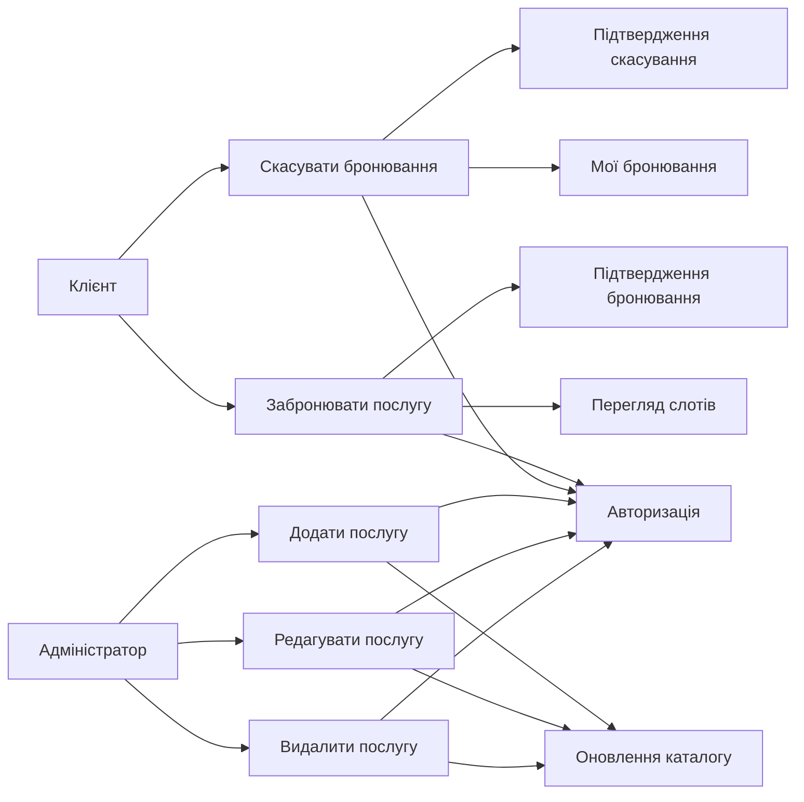
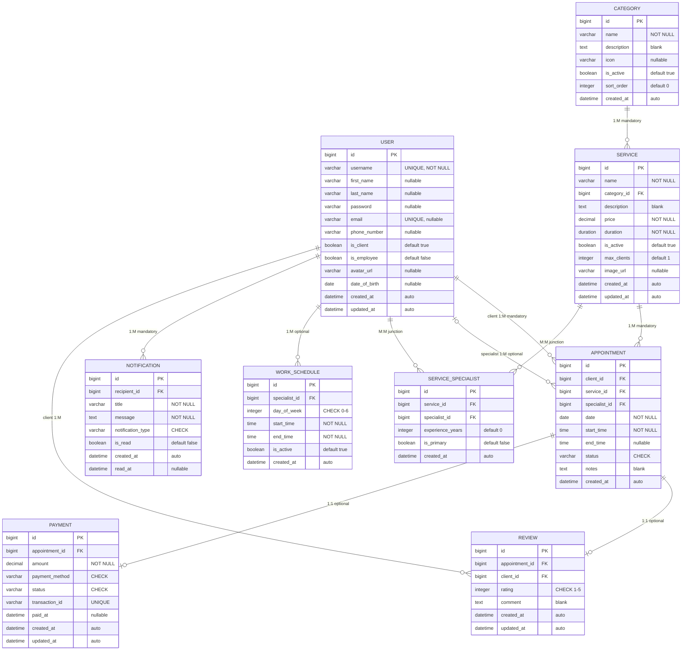
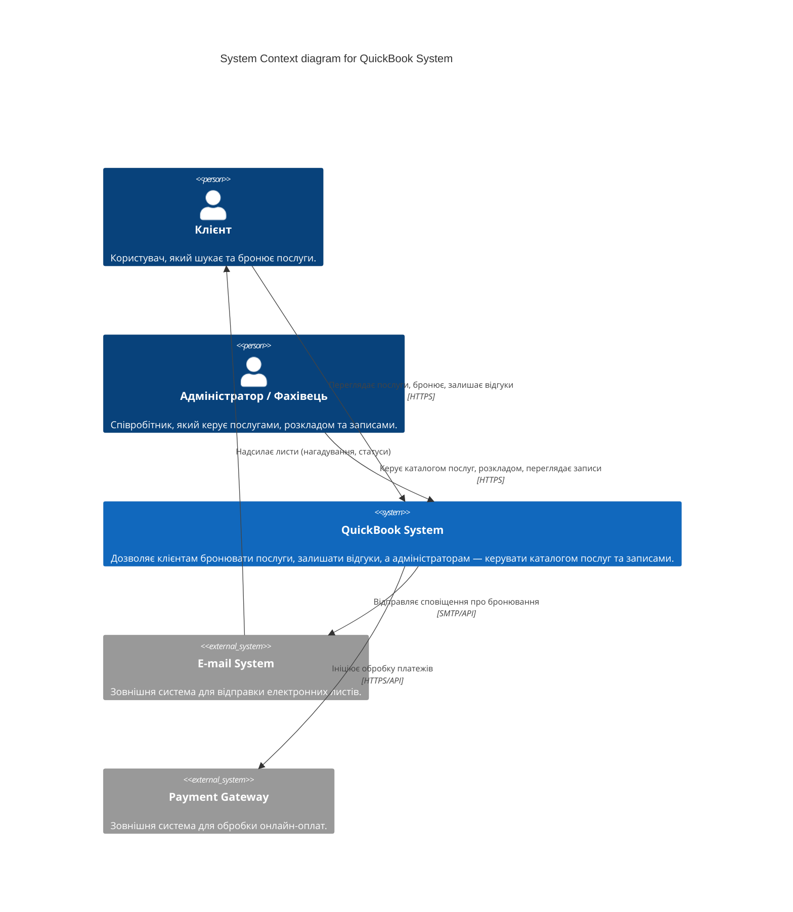
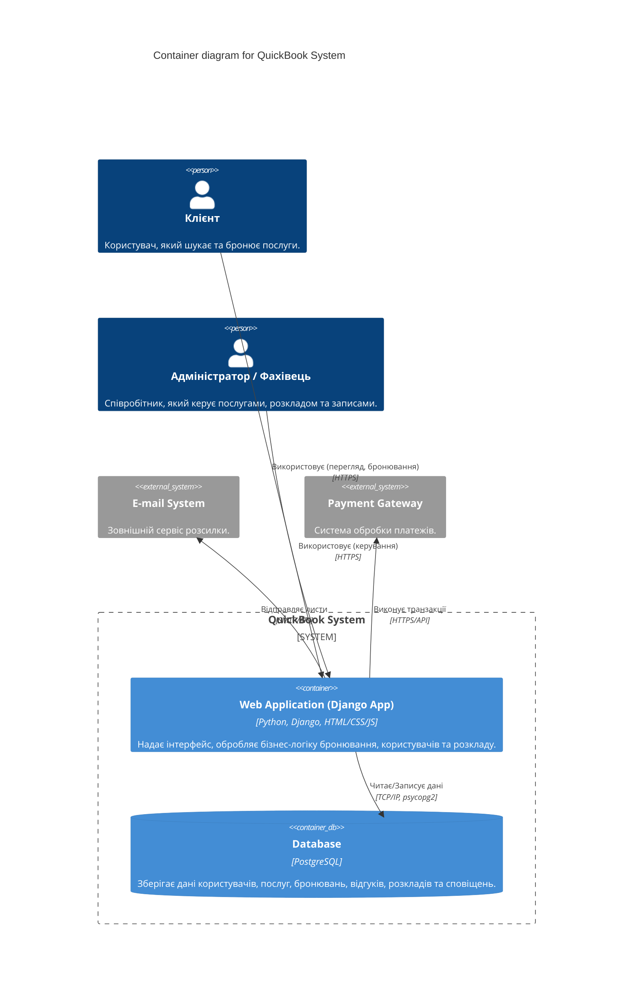

# QuickBook - Система бронювання послуг

## Юзер сторі (User Flows)

**Flow 1: Реєстрація нового клієнта**
*   **Given:** Неавторизований користувач знаходиться на сторінці реєстрації.
*   **When:** Він вводить валідні дані (ім'я, email, номер телефону, пароль) та натискає "Зареєструватися".
*   **Then:** Система створює новий обліковий запис у додатку `users`, авторизує його та перенаправляє на головну сторінку з повідомленням про успішну реєстрацію.

**Flow 2: Авторизація користувача (Логін)**
*   **Given:** Зареєстрований користувач знаходиться на сторінці входу.
*   **When:** Він вводить правильний email та пароль і натискає кнопку "Увійти".
*   **Then:** Система перевіряє облікові дані та перенаправляє користувача до його особистого кабінету.

**Flow 3: Перегляд каталогу послуг**
*   **Given:** Користувач (авторизований або ні) знаходиться на головній сторінці системи.
*   **When:** Він переходить до розділу "Послуги" (додаток `services`).
*   **Then:** Система відображає актуальний список доступних послуг, включаючи їхню назву, опис, тривалість та вартість.

**Flow 4: Бронювання послуги (Створення запису)**
*   **Given:** Авторизований клієнт обрав послугу зі списку та перейшов на сторінку бронювання.
*   **When:** Він обирає доступну дату, вільний часовий слот, фахівця (за наявності) і натискає кнопку "Підтвердити бронювання".
*   **Then:** Система створює новий запис (Appointment) у базі даних зі статусом "Заплановано" (Scheduled) і відображає сторінку з деталями успішного бронювання.

**Flow 5: Перегляд власних бронювань**
*   **Given:** Авторизований клієнт знаходиться у своєму профілі.
*   **When:** Він переходить у розділ "Мої бронювання" (My Appointments).
*   **Then:** Система відображає список усіх його бронювань, відсортований за датою (спочатку найближчі), із зазначенням статусу (Заплановано, Виконано, Скасовано).

**Flow 6: Скасування бронювання клієнтом**
*   **Given:** Авторизований клієнт переглядає список своїх майбутніх бронювань.
*   **When:** Він натискає кнопку "Скасувати" біля певного запису та підтверджує свою дію у спливаючому вікні.
*   **Then:** Система змінює статус бронювання на "Скасовано" (Cancelled), звільняє цей часовий слот у розкладі та відображає повідомлення про успішне скасування.

**Flow 7: Додавання нової послуги адміністратором**
*   **Given:** Адміністратор системи авторизований і знаходиться в панелі керування послугами.
*   **When:** Він заповнює форму створення нової послуги (назва, категорія, ціна) і натискає "Зберегти".
*   **Then:** Система зберігає нову послугу в базі даних, і вона одразу стає доступною для перегляду та бронювання клієнтами.

**Flow 8: Зміна статусу запису (Адміністратор/Співробітник)**
*   **Given:** Адміністратор переглядає розклад бронювань на сьогодні.
*   **When:** Він обирає конкретний запис і змінює його статус на "Виконано" (Completed).
*   **Then:** Система оновлює статус у базі даних та зберігає час завершення прийому.

---

## UML Діаграма прецедентів (Use Case Diagram)


**Опис 3 ключових Use Cases:**

1. **UC1: Забронювати послугу (Book Service)**
   * **Актор:** Клієнт.
   * **Опис:** Клієнт обирає послугу, переглядає доступні години, обирає зручний час і оформлює бронювання. Успішне виконання сценарію вимагає, щоб користувач був авторизований (Login).

2. **UC2: Скасувати бронювання (Cancel Appointment)**
   * **Актор:** Клієнт (або Адміністратор).
   * **Опис:** Клієнт обирає своє існуюче майбутнє бронювання і скасовує його. Система звільняє час для інших клієнтів. Сценарій включає обов'язкову перевірку авторизації (Login).

3. **UC3: Керувати послугами (Manage Services)**
   * **Актор:** Адміністратор.
   * **Опис:** Адміністратор має можливість створювати нові послуги, редагувати їхню вартість або видаляти неактуальні. Цей процес безпосередньо впливає на каталог, який бачать клієнти (Update Catalog). Вимагає авторизації з правами адміністратора.

---

## ERD (Entity-Relationship Diagram)

**9 сутностей** • **11 зв'язків** • **17 обмежень цілісності**

> Інтерактивна HTML-версія діаграми: [`docs/erd_diagram.html`](docs/erd_diagram.html)



### Типи зв'язків

| Зв'язок | Тип | ON DELETE | Обов'язковість |
|---|---|---|---|
| User → Appointment (client) | **1:M** | CASCADE | mandatory |
| User → Appointment (specialist) | **1:M** | SET NULL | optional |
| Category → Service | **1:M** | CASCADE | mandatory |
| Service → Appointment | **1:M** | CASCADE | mandatory |
| Service ↔ User через **ServiceSpecialist** | **M:M** | CASCADE | junction table |
| Appointment → Review | **1:1** | CASCADE | optional |
| Appointment → Payment | **1:1** | CASCADE | optional |
| User → WorkSchedule | **1:M** | CASCADE | optional |
| User → Notification | **1:M** | CASCADE | mandatory |
| User → Review (client) | **1:M** | CASCADE | mandatory |

### Обмеження цілісності (Integrity Constraints)

#### UNIQUE
| Таблиця | Поле(я) | Опис |
|---|---|---|
| User | email | Унікальна електронна адреса |
| User | username | Унікальне ім'я користувача |
| Payment | transaction_id | Унікальний ID транзакції |
| Review | appointment_id | Один відгук на бронювання (OneToOne) |
| Payment | appointment_id | Одна оплата на бронювання (OneToOne) |
| ServiceSpecialist | (service, specialist) | Фахівець призначається на послугу лише раз |
| WorkSchedule | (specialist, day_of_week) | Один графік на день для фахівця |

#### CHECK
| Таблиця | Поле | Правило |
|---|---|---|
| Appointment | status | IN ('scheduled', 'completed', 'cancelled') |
| Review | rating | >= 1 AND <= 5 |
| Payment | status | IN ('pending', 'paid', 'refunded', 'failed') |
| Payment | payment_method | IN ('cash', 'card', 'online') |
| WorkSchedule | day_of_week | >= 0 AND <= 6 |
| Notification | notification_type | IN ('reminder', 'status_change', 'cancellation', 'promotion', 'system') |

#### NOT NULL (критичні поля)
| Таблиця | Поля |
|---|---|
| User | username |
| Appointment | client_id, service_id, date, start_time |
| Service | name, price, duration, category_id |
| Payment | amount, payment_method, appointment_id |
| Notification | recipient_id, title, message |

---

## Словник даних (Data Dictionary)

### 1. User (Користувач)

| Field | Type | Nullable | Key | Default | Constraints | Description |
|---|---|---|---|---|---|---|
| id | bigint | No | PK | auto-increment | — | Унікальний ідентифікатор користувача |
| username | varchar(150) | No | — | — | UNIQUE, NOT NULL | Ім'я для входу в систему |
| first_name | varchar(40) | Yes | — | NULL | — | Ім'я користувача |
| last_name | varchar(40) | Yes | — | NULL | — | Прізвище користувача |
| password | varchar(255) | Yes | — | NULL | — | Хеш пароля |
| email | varchar(254) | Yes | — | NULL | UNIQUE | Електронна адреса |
| phone_number | varchar(15) | Yes | — | NULL | — | Номер телефону |
| is_client | boolean | No | — | true | — | Чи є користувач клієнтом |
| is_employee | boolean | No | — | false | — | Чи є користувач співробітником |
| avatar_url | varchar(500) | Yes | — | NULL | — | URL зображення аватару |
| date_of_birth | date | Yes | — | NULL | — | Дата народження |
| is_active | boolean | No | — | true | — | Чи активний обліковий запис (Django) |
| is_staff | boolean | No | — | false | — | Чи має доступ до адмін-панелі (Django) |
| is_superuser | boolean | No | — | false | — | Чи є суперкористувачем (Django) |
| date_joined | datetime | No | — | auto (now) | — | Дата реєстрації (Django) |
| last_login | datetime | Yes | — | NULL | — | Час останнього входу (Django) |
| created_at | datetime | No | — | auto_now_add | — | Дата створення запису |
| updated_at | datetime | No | — | auto_now | — | Дата останнього оновлення |

### 2. Category (Категорія)

| Field | Type | Nullable | Key | Default | Constraints | Description |
|---|---|---|---|---|---|---|
| id | bigint | No | PK | auto-increment | — | Унікальний ідентифікатор категорії |
| name | varchar(100) | No | — | — | NOT NULL | Назва категорії послуг |
| description | text | No | — | '' (blank) | — | Текстовий опис категорії |
| icon | varchar(100) | Yes | — | NULL | — | Назва або клас іконки (CSS/SVG) |
| is_active | boolean | No | — | true | — | Чи відображається категорія клієнтам |
| sort_order | integer | No | — | 0 | — | Порядок відображення у списку |
| created_at | datetime | No | — | auto_now_add | — | Дата створення запису |

### 3. Service (Послуга)

| Field | Type | Nullable | Key | Default | Constraints | Description |
|---|---|---|---|---|---|---|
| id | bigint | No | PK | auto-increment | — | Унікальний ідентифікатор послуги |
| name | varchar(255) | No | — | — | NOT NULL | Назва послуги |
| category_id | bigint | No | FK → Category | — | NOT NULL, ON DELETE CASCADE | Категорія, до якої належить послуга |
| description | text | No | — | '' (blank) | — | Детальний опис послуги |
| price | decimal(10,2) | No | — | — | NOT NULL | Вартість послуги (у грн) |
| duration | interval | No | — | — | NOT NULL | Тривалість надання послуги |
| is_active | boolean | No | — | true | — | Чи доступна послуга для бронювання |
| max_clients | integer | No | — | 1 | NOT NULL, ≥ 0 | Максимальна кількість клієнтів одночасно |
| image_url | varchar(500) | Yes | — | NULL | — | URL зображення послуги |
| created_at | datetime | No | — | auto_now_add | — | Дата створення запису |
| updated_at | datetime | No | — | auto_now | — | Дата останнього оновлення |

### 4. ServiceSpecialist (Фахівець послуги — Junction Table M:M)

| Field | Type | Nullable | Key | Default | Constraints | Description |
|---|---|---|---|---|---|---|
| id | bigint | No | PK | auto-increment | — | Унікальний ідентифікатор зв'язку |
| service_id | bigint | No | FK → Service | — | NOT NULL, UNIQUE(service, specialist), ON DELETE CASCADE | Послуга |
| specialist_id | bigint | No | FK → User | — | NOT NULL, UNIQUE(service, specialist), ON DELETE CASCADE | Фахівець, що надає послугу |
| experience_years | integer | No | — | 0 | NOT NULL, ≥ 0 | Кількість років досвіду фахівця у даній послузі |
| is_primary | boolean | No | — | false | — | Чи є основним фахівцем для цієї послуги |
| created_at | datetime | No | — | auto_now_add | — | Дата створення запису |

### 5. Appointment (Бронювання)

| Field | Type | Nullable | Key | Default | Constraints | Description |
|---|---|---|---|---|---|---|
| id | bigint | No | PK | auto-increment | — | Унікальний ідентифікатор бронювання |
| client_id | bigint | No | FK → User | — | NOT NULL, ON DELETE CASCADE | Клієнт, який створив бронювання |
| service_id | bigint | No | FK → Service | — | NOT NULL, ON DELETE CASCADE | Обрана послуга |
| specialist_id | bigint | Yes | FK → User | NULL | ON DELETE SET NULL | Призначений фахівець (необов'язково) |
| date | date | No | — | — | NOT NULL | Дата бронювання |
| start_time | time | No | — | — | NOT NULL | Час початку послуги |
| end_time | time | Yes | — | NULL | — | Час завершення послуги |
| status | varchar(20) | No | — | 'scheduled' | CHECK (status IN ('scheduled','completed','cancelled')) | Поточний статус бронювання |
| notes | text | No | — | '' (blank) | — | Додаткові примітки до бронювання |
| created_at | datetime | No | — | auto_now_add | — | Дата створення запису |

### 6. Review (Відгук)

| Field | Type | Nullable | Key | Default | Constraints | Description |
|---|---|---|---|---|---|---|
| id | bigint | No | PK | auto-increment | — | Унікальний ідентифікатор відгуку |
| appointment_id | bigint | No | FK → Appointment | — | UNIQUE (OneToOne), NOT NULL, ON DELETE CASCADE | Бронювання, до якого залишено відгук |
| client_id | bigint | No | FK → User | — | NOT NULL, ON DELETE CASCADE | Клієнт, що залишив відгук |
| rating | integer | No | — | — | NOT NULL, CHECK (rating >= 1 AND rating <= 5) | Оцінка від 1 до 5 зірок |
| comment | text | No | — | '' (blank) | — | Текстовий коментар клієнта |
| created_at | datetime | No | — | auto_now_add | — | Дата створення відгуку |
| updated_at | datetime | No | — | auto_now | — | Дата останнього редагування |

### 7. Payment (Оплата)

| Field | Type | Nullable | Key | Default | Constraints | Description |
|---|---|---|---|---|---|---|
| id | bigint | No | PK | auto-increment | — | Унікальний ідентифікатор оплати |
| appointment_id | bigint | No | FK → Appointment | — | UNIQUE (OneToOne), NOT NULL, ON DELETE CASCADE | Бронювання, за яке здійснена оплата |
| amount | decimal(10,2) | No | — | — | NOT NULL | Сума оплати (у грн) |
| payment_method | varchar(20) | No | — | — | NOT NULL, CHECK (payment_method IN ('cash','card','online')) | Метод оплати |
| status | varchar(20) | No | — | 'pending' | CHECK (status IN ('pending','paid','refunded','failed')) | Статус оплати |
| transaction_id | varchar(255) | Yes | — | NULL | UNIQUE | Унікальний ідентифікатор транзакції у платіжній системі |
| paid_at | datetime | Yes | — | NULL | — | Дата та час фактичної оплати |
| created_at | datetime | No | — | auto_now_add | — | Дата створення запису |
| updated_at | datetime | No | — | auto_now | — | Дата останнього оновлення |

### 8. WorkSchedule (Робочий графік)

| Field | Type | Nullable | Key | Default | Constraints | Description |
|---|---|---|---|---|---|---|
| id | bigint | No | PK | auto-increment | — | Унікальний ідентифікатор запису графіку |
| specialist_id | bigint | No | FK → User | — | NOT NULL, UNIQUE(specialist, day_of_week), ON DELETE CASCADE | Фахівець |
| day_of_week | integer | No | — | — | NOT NULL, CHECK (day_of_week >= 0 AND day_of_week <= 6) | День тижня (0=Пн, 1=Вт, …, 6=Нд) |
| start_time | time | No | — | — | NOT NULL | Час початку робочого дня |
| end_time | time | No | — | — | NOT NULL | Час завершення робочого дня |
| is_active | boolean | No | — | true | — | Чи активний цей розклад |
| created_at | datetime | No | — | auto_now_add | — | Дата створення запису |

### 9. Notification (Сповіщення)

| Field | Type | Nullable | Key | Default | Constraints | Description |
|---|---|---|---|---|---|---|
| id | bigint | No | PK | auto-increment | — | Унікальний ідентифікатор сповіщення |
| recipient_id | bigint | No | FK → User | — | NOT NULL, ON DELETE CASCADE | Користувач-отримувач сповіщення |
| title | varchar(255) | No | — | — | NOT NULL | Заголовок сповіщення |
| message | text | No | — | — | NOT NULL | Текст повідомлення |
| notification_type | varchar(20) | No | — | 'system' | CHECK (type IN ('reminder','status_change','cancellation','promotion','system')) | Тип сповіщення |
| is_read | boolean | No | — | false | — | Чи прочитане сповіщення |
---

## Архітектура системи (C4 Model)

Детальний опис архітектури знаходиться у файлі [`docs/c4_architecture.md`](docs/c4_architecture.md).

### C4 Level 1: System Context Diagram



### C4 Level 2: Container Diagram



---

## Структура репозиторію

Репозиторій розділений на логічні частини:

```text
QuickBook/
├── backend/                  # Вихідний код Django додатка
│   ├── QuickBook/            # Головний конфігураційний пакет Django
│   ├── appointments/         # Додаток бронювань, платежів та відгуків
│   ├── services/             # Додаток послуг та категорій
│   ├── users/                # Додаток користувачів, розкладів та сповіщень
│   ├── Dockerfile            # Інструкції збірки контейнера для бекенду
│   ├── manage.py             # Утиліта керування Django
│   └── requirements.txt      # Залежності Python
├── docs/                     # Документація (C4, ERD діаграми)
│   ├── c4_architecture.md    # Опис архітектури
│   └── erd_diagram.html      # Інтерактивна ERD діаграма
├── docker-compose.yml        # Конфігурація Docker Compose (backend + db)
├── .env.example              # Приклад змінних середовища
└── README.md                 # Головний файл документації
```

---

## Інструкція із запуску (Docker Compose)

Проєкт налаштований для легкого розгортання за допомогою Docker Compose. Включає два сервіси: `backend` (Django) та `db` (PostgreSQL). Для БД налаштовано іменований **volume** (`postgres_data`), що гарантує збереження даних після перезапуску контейнерів.

### 1. Підготовка середовища

Створіть файл `.env` у корені проєкту на основі прикладу:

```bash
cp .env.example .env
```

### 2. Запуск контейнерів

Запустіть збірку та підняття контейнерів у фоновому режимі:

```bash
docker-compose up -d --build
```

Система підніме базу даних, бекенд (Django) та **фронтенд (React)**.
- Django API доступне за адресою: `http://localhost:8000`
- **Клієнтський веб-додаток (React): `http://localhost:5173`**

### 3. Застосування міграцій бази даних

Після успішного запуску контейнерів, необхідно створити структуру бази даних:

```bash
docker-compose exec backend python manage.py migrate
```

### 4. Створення суперкористувача (Адміністратора)

Для доступу до адмін-панелі (`http://localhost:8000/admin/`), створіть суперкористувача:

```bash
docker-compose exec backend python manage.py createsuperuser
```

### 5. Перевірка працездатності (Persistence / Volumes)

Щоб переконатися, що дані не зникають:
1. Створіть суперкористувача (крок 4) або додайте послугу в БД.
2. Зупиніть і видаліть контейнери командою:
   ```bash
   docker-compose down
   ```
3. Запустіть їх знову:
   ```bash
   docker-compose up -d
   ```
4. Спробуйте увійти в адмін-панель зі створеним раніше логіном/паролем. Якщо вхід успішний — volume налаштовано вірно і дані персистентні.

---

## API Контракт (OpenAPI / Swagger)

Проєкт підтримує автоматичну генерацію документації API за допомогою `drf-spectacular` (OpenAPI 3). 
Статичний API-контракт збережено у файлі: [`docs/openapi.yaml`](docs/openapi.yaml).

### Доступні інтерфейси документації:

Після запуску проєкту, документація доступна за наступними посиланнями:
- **Swagger UI** (Інтерактивний інтерфейс): [http://localhost:8000/api/docs/swagger-ui/](http://localhost:8000/api/docs/swagger-ui/)
- **ReDoc** (Альтернативний перегляд): [http://localhost:8000/api/docs/redoc/](http://localhost:8000/api/docs/redoc/)
- **OpenAPI Schema** (YAML/JSON формат): [http://localhost:8000/api/schema/](http://localhost:8000/api/schema/)

### Приклади використання API (cURL)

**1. Отримання списку категорій (GET)**
```bash
curl -X 'GET' \
  'http://localhost:8000/api/categories/' \
  -H 'accept: application/json'
```

**2. Отримання списку послуг (GET)**
```bash
curl -X 'GET' \
  'http://localhost:8000/api/services/' \
  -H 'accept: application/json'
```

**3. Створення нового бронювання (POST)**
*Примітка: для створення бронювання потрібна авторизація (передача Session Cookie або Basic Auth).*
```bash
curl -X 'POST' \
  'http://localhost:8000/api/appointments/' \
  -H 'accept: application/json' \
  -H 'Content-Type: application/json' \
  -d '{
  "service": 1,
  "specialist": 2,
  "date": "2026-06-01",
  "start_time": "10:00:00",
  "status": "scheduled",
  "notes": "Потрібна консультація"
}'
```
