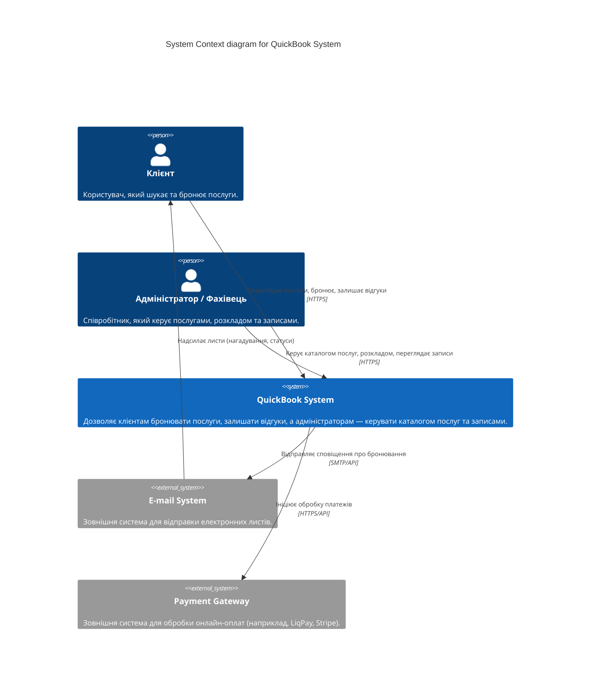
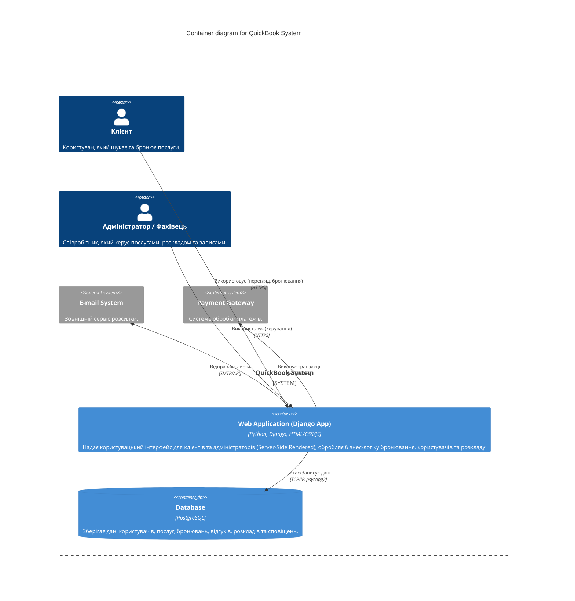

# QuickBook — Архітектура Системи (C4 Model)

Цей документ описує архітектуру системи бронювання послуг QuickBook на рівнях Контексту (Level 1) та Контейнерів (Level 2).

## C4 Level 1: System Context Diagram

Діаграма контексту показує систему QuickBook в оточенні її користувачів та зовнішніх систем.

## C4 Level 2: Container Diagram

Діаграма контейнерів розкриває внутрішню структуру системи QuickBook, показуючи веб-додаток (який поєднує Frontend та Backend в Django) та базу даних.

## Деталі Контейнерів

1. **Web Application (Django App)**:
   * **Технології**: Python 3.12, Django 6, Django REST Framework (якщо планується API для окремого фронтенду).
   * **Роль**: Обслуговує HTTP запити, рендерить HTML-сторінки (або видає JSON API), керує сесіями та аутентифікацією, реалізує бізнес-логіку (перевірка доступності слотів, зміна статусів).
2. **Database (PostgreSQL)**:
   * **Технології**: PostgreSQL 15.
   * **Роль**: Надійне реляційне сховище для усіх сутностей (User, Service, Appointment, Review, Payment тощо), налаштоване через Docker Volume для збереження даних.
